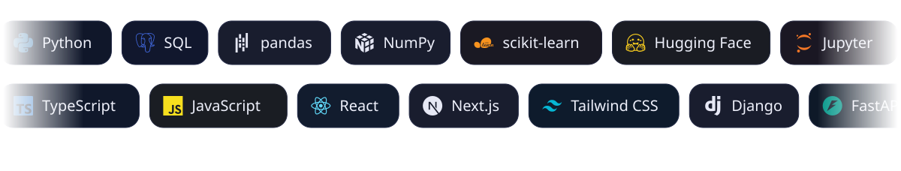

 

<picture>
  <source media="(prefers-color-scheme: light)" srcset="assets/sections/01-tech-stack-light.svg" />
  
</picture>

 

<picture>
  <source media="(prefers-color-scheme: light)" srcset="assets/sections/02-recognition-light.svg" />
  
</picture>

