


&nbsp;
&nbsp;

 

<picture>
  <source media="(prefers-color-scheme: light)" srcset="assets/sections/01-about-me-light.svg" />
  
</picture>


 

<picture>
  <source media="(prefers-color-scheme: light)" srcset="assets/sections/02-featured-work-light.svg" />
  
</picture>

  <a href="https://www.linkedin.com/in/alejandro-cuevas-cid/"></a>
  <a href="https://github.com/DRO98/archtrace-auditor"></a>
  <a href="https://github.com/DRO98/HS-Maisa-Hackathon"></a>
  <a href="https://github.com/DRO98/madrid-inteligencia-comercial"></a>
  <a href="https://github.com/DRO98/Hackaton_BEST_BETECH"></a>
  <a href="https://github.com/DRO98/Hackaton_IndesIA"></a>

  <b>Live demos</b>&nbsp; → &nbsp;<a href="https://albertitos.vercel.app">albertitos.vercel.app</a> &nbsp;·&nbsp; <a href="https://dro98.github.io/madrid-inteligencia-comercial/">madrid-inteligencia-comercial</a> &nbsp;·&nbsp; <a href="https://dro98.github.io/portfolio-alejandro/">portfolio</a>

 

<picture>
  <source media="(prefers-color-scheme: light)" srcset="assets/sections/03-data-engineering-lab-light.svg" />
  
</picture>


  
    <a href="https://github.com/DRO98/practica-kafka-etsit">practica-kafka-etsit</a> &nbsp;·&nbsp;
    <a href="https://github.com/DRO98/Data-Engineering-Practice-Flight-Prediction-with-Spark-Airflow">flight-prediction-with-spark-airflow</a> &nbsp;·&nbsp;
    <a href="https://github.com/DRO98/k8s-iot-monitoring-madrid">k8s-iot-monitoring-madrid</a> &nbsp;·&nbsp;
    <a href="https://github.com/DRO98/Spotify-and-Tuberculosis-Data-Analysis">data-analysis</a> &nbsp;·&nbsp;
    <a href="https://github.com/DRO98/LeetCode">leetcode</a>
  

 

<picture>
  <source media="(prefers-color-scheme: light)" srcset="assets/sections/04-tech-stack-light.svg" />
  
</picture>

 

<picture>
  <source media="(prefers-color-scheme: light)" srcset="assets/sections/05-recognition-light.svg" />
  
</picture>


 

<picture>
  <source media="(prefers-color-scheme: light)" srcset="assets/sections/06-live-telemetry-light.svg" />
  
</picture>


<picture>
  <source media="(prefers-color-scheme: dark)" srcset="https://raw.githubusercontent.com/DRO98/DRO98/output/snake-dark.svg" />
  <source media="(prefers-color-scheme: light)" srcset="https://raw.githubusercontent.com/DRO98/DRO98/output/snake-light.svg" />
  
</picture>

 

<picture>
  <source media="(prefers-color-scheme: light)" srcset="assets/footer-light.svg" />
  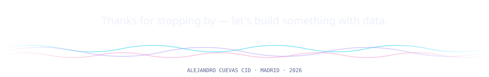
</picture>
